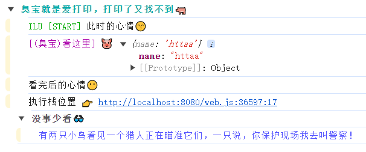

## sao code
## Polyfill 补充、添加、填充、衣物、增加、js、骚

### Style Console

- 搞怪风格log打印，让枯燥的上班时间添加乐趣


```ts
import SConsole from 'sao-code/dist/core/console';
SConsole.install();
```

### thelotusroot
- 统一注册 thelotusroot 相关函数 （或者使用下面的单文件注册）

```ts
import thelotusroot from 'sao-code/dist/core/thelotusroot';
thelotusroot.install();
```
- types

```ts
declare const _default: {
    install(wran?: boolean): void;
};
export default _default;
```

#### toPromised Polyfill

- 假如希望一个回调函数转成promise使用， 你可以这样：
```js
const test = function name(params, ca, ca2) {
    ca?.(params, 1, 2, 3)
    ca2?.(params, 4, 5,6)
    return true
}
```
1. 正常调用`test`函数

```js
    test('abc', () => {}, () => {});
```
2. 通过 `toPromised`

```js
 const result = await test.toPromised('abc', '$func', '$func');
 
 /**
  * result 输出：
  * [
  *    [0, 1, 2, 3],  # 这个是第一个 callback 的参数
  *    [0, 4, 5, 6],  # 这个是第二个 callback 的参数
  *    true,          # 这个是函数return的参数
  * ]
  */
```
- 你也可以这样来使用 `toPromised`
```js
 const result = await test.toPromised('abc', '$func', (...arg) => {
    console.log(...arg,  '正常回调')
 });

 /**
  * result 输出：
  * [
  *    [0, 1, 2, 3],  # 这个是第一个 callback 的参数
  *    true,          # 这个是函数return的参数
  * ]
  */
```
##### 如何注册

```js
// 执行的环境
import { PromiseLotusRoot } from 'sao-code/dist/core/thelotusroot/promise';
new PromiseLotusRoot().setup();
```
- types
```ts
declare class PromiseLotusRoot(self?: FunctionConstructor): PromiseLotusRoot;
```


#### Clone Polyfill
- 如何克隆一个对象？

- lodash方式
```ts
  const a = lodash.cloneDeep(b);
```

- 在这里你可以这样使用：
```ts
// main.js # 入口文件
import { ProtoClone } from 'sao-code/dist/core/thelotusroot/clone';
new ProtoClone().install(); // 注册后 默认会给 ObjectConstructor、StringConstructor 原型添加clone 函数

// web 环境下
// 测试代码
const original = {
  a: 1,
  b: {
    c: 2,
    d: [3, 4]
  },
  e: () => 'original'
}
const clone = original.toCloned(); // 浅克隆
original.a = 2; // 2
console.log(clone.a) // 1
original.b.c = 3; // 3
console.log(clone.b.c) // 3

// ----------------------------------------

const clone = original.toCloned(true); // 深克隆
original.b.c = 3; // 3
console.log(clone.b.c) // 2

```
- types
```ts
declare class ProtoClone {
    selfs: (ObjectConstructor | StringConstructor)[];
    constructor(selfs?: (ObjectConstructor | StringConstructor)[]);
    static get _name(): string;
    static clone(deep: boolean): any;
    install(wran?: boolean): void;
}
export { ProtoClone, };
```

#### Catch
- 注册后Function存在一个捕获函数 catch
```ts
import { ProtoCatch } from 'sao-code/dist/core/thelotusroot/catch';
new ProtoCatch().install();

const test = () => {
    throw Error('test b error')
}

test() // 报错了， 代码执行终止了
test.catch(); // 报错了， 打印、返回捕获， 继续执行代码
/**
 * Error: test b error
    at Function.b (<anonymous>:2:11)
 */
```

#### array Polyfill 兼容浏览器
```ts
declare Array.prototype.toReversed();
declare Array.prototype.toSorted();
declare Array.prototype.toSpliced();
```
##### 如何注册

```ts
// 执行的环境
import { ProtoArray } 'sao-code/dist/core/thelotusroot/array';
ProtoArray.install(undefined, wran);
```
- types

```ts
import { ToProtoType } from './extends/proto';
export declare class ProToReversed extends ToProtoType {
    constructor(self?: ArrayConstructor[]);
    get _name(): string;
    setup(): any[];
}
export declare class ProToSorted extends ToProtoType {
    constructor(self?: ArrayConstructor[]);
    get _name(): string;
    setup(...arg: any[]): any[];
}
export declare class ProToSpliced extends ToProtoType {
    constructor(self?: ArrayConstructor[]);
    get _name(): string;
    setup(...arg: any[]): any;
}
export declare class ProtoArray {
    static install(self?: ArrayConstructor[], warn?: boolean): void;
}

```

#### withResolves Polyfill 兼容浏览器
```ts
declare Promise.withResolvers();
```
##### 如何注册

```js
// 执行的环境
import { WithResolves } from 'sao-code/dist/core/thelotusroot/withResolves';
 new WithResolves().install();
```
- types

```ts
import { ToProtoType } from './extends/proto';
export declare class WithResolves extends ToProtoType {
    constructor(self?: PromiseConstructor[]);
    get _name(): string;
    setup(): {
        promise: Promise<unknown>;
        resolve: undefined;
        reject: undefined;
    };
}

```
### Object
- 给对象注册函数
```ts
import { ProtoClone } from 'sao-code/dist/core/thelotusroot/clone';
import { ProtoOmit } from 'sao-code/dist/core/thelotusroot/omit';
import { ProtoOmitBy } from 'sao-code/dist/core/thelotusroot/omitBy';
import { ProtoPick } from 'sao-code/dist/core/thelotusroot/pick';
import { ProtoPickBy } from 'sao-code/dist/core/thelotusroot/pickBy';
new ProtoOmit().install(wran);
new ProtoOmitBy().install(wran);
new ProtoPick().install(wran);
new ProtoPickBy().install(wran);
```
- toOmitByed 功能等同 loadsh/omitBy
- toOmited 功能等同 loadsh/omit
- toPickByed 功能等同 loadsh/pickBy
- toPicked 功能等同 loadsh/pick

```ts
    // 测试代码
    const original = {
        a: 1,
        b: {
            c: 2,
            d: [3, 4]
        },
        e: () => 'original'
    }
    original.toOmitByed();
    original.toOmited();
    original.toPickByed();
    original.toPicked();
```

#### copyEffect
```ts
import { ProtoCopyEffect } from 'sao-code/dist/core/thelotusroot/copyEffect';
ProtoCopyEffect.install();
```
- 作用
```ts
    const a = {}
    const b = {name: '123', age: 18}
    a.copyEffect(b, [], ['name']) // {age: 18}
    a.copyEffect(b, ['name']) // {name: '123'}
    a.copyEffect(b) // {name: '123', age: 18}
    a.copyEffect(); // 输出自身
```


<!------------------------------------------------------------------------------------------------------------->

### directives
#### 图片懒加载指令

```ts
/**
 * vue 图片懒加载指令
 */
export declare const lazyImage: {
    [x: 'inserted' | 'onMounted'](el: HTMLImageElement, binding: {
        value: string;
    }): void;
    [x: 'unbind' | 'onUnMounted'](el: HTMLImageElement): void;
};

```

##### 如何引用

```vue
<script>
// 执行的环境
import { lazyImage } from 'sao-code/dist/core/directives';

export default {
    filters: {
        lazyImage,
    }
}
</script>
```

<!------------------------------------------------------------------------------------------------------------->

### utils
#### useInview

```ts
/**
 * 监听元素是否可见
 * @param el
 * @param callback
 * @param option
 */
export declare function useInview(el: Ref<HTMLElement>, callback: (enter: IntersectionObserverEntry) => void, option?: {
    once?: boolean;
}): void;

```
##### 如何引用

```vue
<script setup>
// 执行的环境 Vu3
// 1
import { useInview } from 'sao-code/dist/core/utils';
import { ref } from 'vue';

const elRef = ref();
useInview(elRef, () => {

});
</script>
```